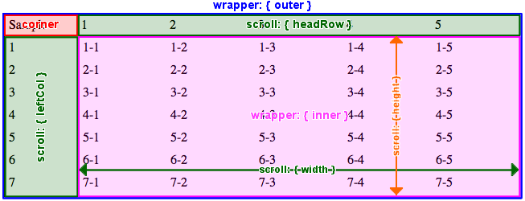
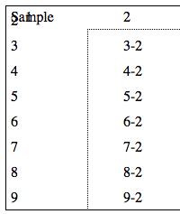

# Fixed Table Header and Left Column

## Description

fixedTblHdrLftCol is a jQuery plugin to modify a table element with a fixed header element and fixed left columns.

## Requirements

* [jQuery](http://jquery.com/) v2.1.1+.
* The header/body must be wrapped around by a THEAD/TBODY element.

## Settings

Option 1  |Option 2  |Option 3 |Default value        |Datatype|Remarks
:---------|:---------|:--------|:--------------------|:-------|:------
scroll {} |height    |         |null                 |String  |Scroll area height
          |width     |         |null                 |String  |Scroll area width
          |headRow {}|className|'fTHLC-head-row'     |String  |Class name for position fixed TH elements
          |          |enabled  |true                 |Boolean |Scroll event
          |          |overflow |'auto'               |String  |CSS overflow property
          |leftCol {}|className|'fTHLC-left-col'     |String  |Class name for position fixed TD elements
          |          |enabled  |true                 |Boolean |Scroll event
          |          |overflow |'auto'               |String  |CSS overflow property
          |          |fixedSpan|1                    |Number  |Number of left columns to be fixed
          |syncWith  |         |null                 |String  |jQuery Selector
wrapper {}|outer {}  |idName   |null                 |String  |ID name for outer DIV element
          |          |className|'fTHLC-outer-wrapper'|String  |Class name for outer DIV element
          |inner {}  |idName   |null                 |String  |ID name for inner DIV element
          |          |className|'fTHLC-inner-wrapper'|String  |Class name for inner div element
corner {} |append    |         |true                 |Boolean |Clone top left corner
          |deepClone |         |false                |Boolean |Clone with events
          |outer {}  |idName   |null                 |String  |ID name for outer DIV element
          |          |className|'fTHLC-outer-corner' |String  |Class name for outer DIV element
          |inner {}  |idName   |null                 |String  |ID name for inner cloned TABLE element
          |          |className|'fTHLC-inner-corner' |String  |Class name for inner cloned TABLE element

### Top Left Corner

When you set the **corner.appended** option to *false* and scrolled the table, the top left corner will be look like this. 

If this option was *true*, the plugin will automaticaly clone the top left corner of the table and append it to most front. If it's event handlers were bounded before, please set **corner.deepClone** option to *true*.

### Syncronize Scroll Events
If there were two or more tables which you want to syncronize the scroll events, set the jQuery selector to **scroll.syncWith** option.

## TODO

Currently, this plugin does NOT support COLSPAN and ROWSPAN attributes.

## Browsers

This plugin is tested with following browsers:

* Apple Safari 7.0+
* Google Chrome 35.0+
* Mozilla Firefox 30.0+ 

## Samples

All samples are written in HTML5/CSS3. The jQuery CDN and the [YUI CSS Reset](http://yuilibrary.com/yui/docs/cssreset/) CDN are used. 

0. [Basic](http://nkmrshn.com/fixedTblHdrLftCol/samples/sample_0_basic.html)
1. [Multi-fixed 1](http://nkmrshn.com/fixedTblHdrLftCol/samples/sample_1_multi.html)
2. [Multi-fixed 2](http://nkmrshn.com/fixedTblHdrLftCol/samples/sample_2_multi.html)
3. [Syncronize scroll events](http://nkmrshn.com/fixedTblHdrLftCol/samples/sample_3_sync.html)

## License

Released under the [MIT license](http://www.opensource.org/licenses/MIT).
